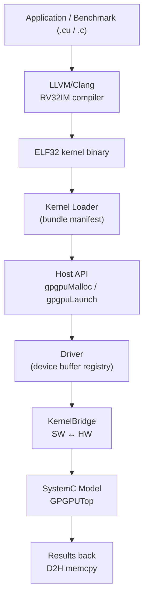
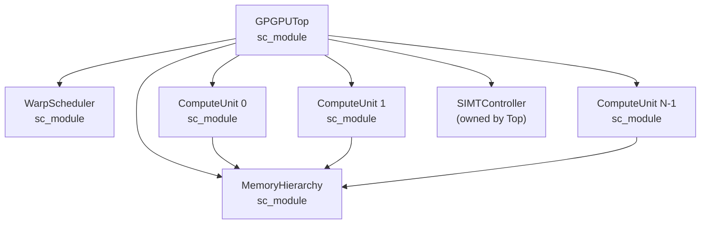
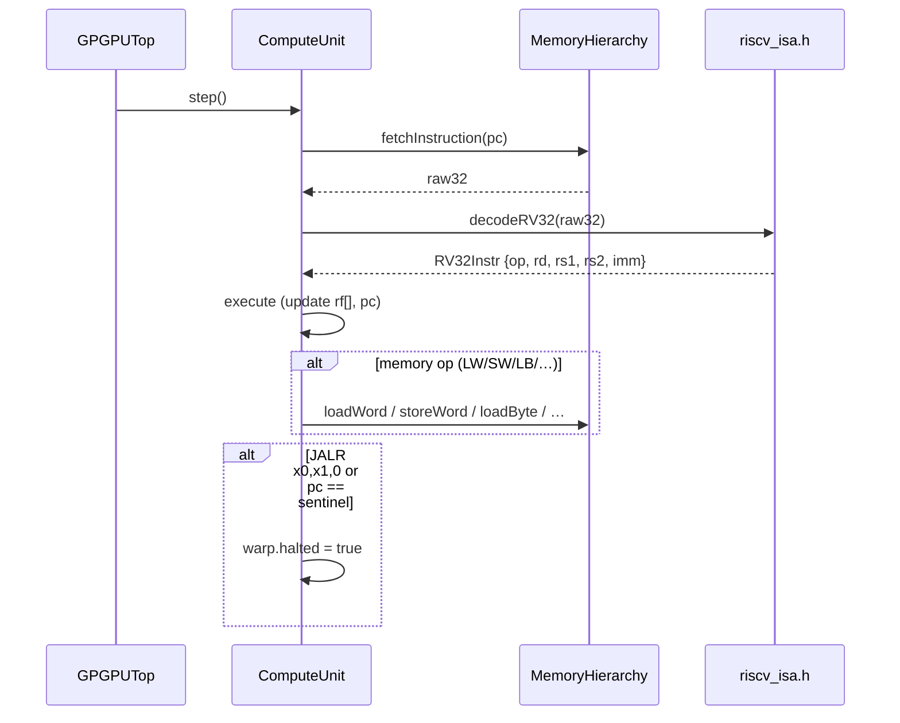
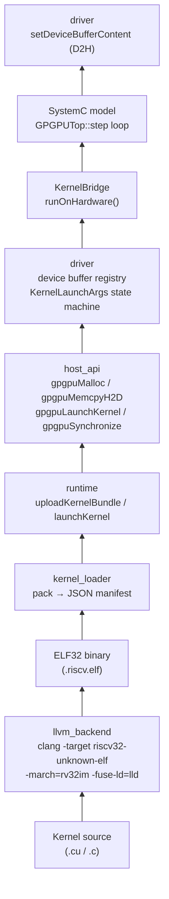
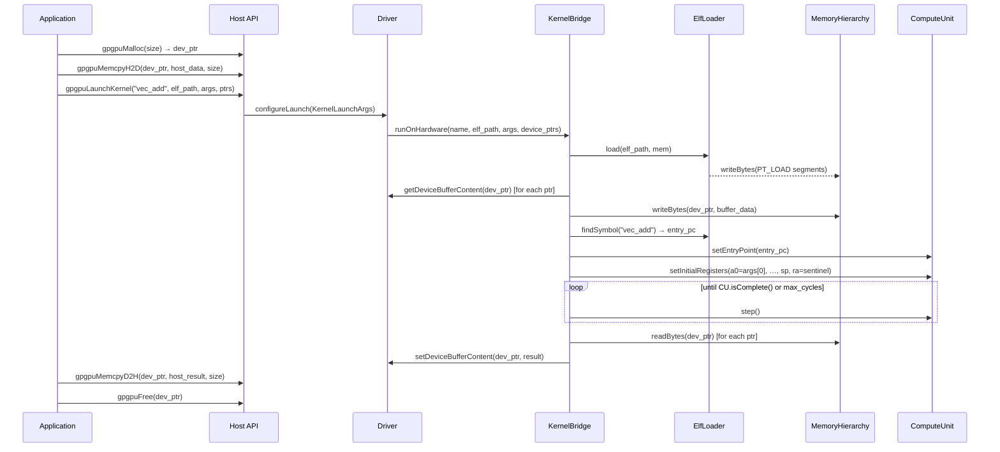

# RISC-V GPGPU — Architecture & Implementation Reference

> **Branch**: `gpgpu/hardware_main`  
> **Status**: Software stack complete + SystemC functional model integrated; multi-CU parallel execution path in progress.

---

## 1. System Overview

The RISC-V GPGPU is a configurable, research-oriented GPU computing platform where every shader/compute thread executes the **RV32IM** instruction set. The design follows a classical SIMT (Single Instruction, Multiple Threads) GPU model — comparable to NVIDIA Volta at the architecture level — but built entirely from open components.



---

## 2. Parallel Execution Model

### Grid → Block → Warp → Thread hierarchy

```
Kernel launch(grid_x, grid_y)
│
├── Block [0,0] ──► CU 0  (32 threads = 1 warp, up to 16 warps)
├── Block [1,0] ──► CU 1
├── Block [2,0] ──► CU 2
├── Block [3,0] ──► CU 3
├── Block [4,0] ──► CU 0  (round-robin wrap)
└── ...
```

Each **Compute Unit (CU)** handles one or more **warps**. One warp = 32 threads that share a single program counter and execute in lockstep (SIMT). Thread divergence at a branch is tracked by the `SIMTController` using a per-warp active-mask stack.

### Where the configuration lives

| Layer | File | Key parameters |
|-------|------|----------------|
| Architecture definition | `config/arch_config.yaml` | `num_compute_units`, `threads_per_warp`, `max_warps_per_cu`, cache sizes |
| Scenario scripts | `scripts/scenarios/baseline.sh` | 4 CUs / 32 threads / 16 warps |
| | `scripts/scenarios/high_throughput.sh` | 8 CUs / 32 threads / 32 warps |
| | `scripts/scenarios/power_efficient.sh` | 2 CUs / 32 threads / 8 warps |
| SystemC top-level | `models/systemc/top/top.h` → `GPGPUTop::Config` | C++ struct, same fields |
| KernelBridge | `models/systemc/integration/kernel_bridge.h` → `KernelBridge::Config` | Defaults: 1 CU (functional sim) |
| Common constants | `models/systemc/common/types.h` | `DEFAULT_THREADS_PER_WARP=32`, `DEFAULT_MAX_WARPS_PER_CU=16` |

> **Important gap**: `KernelBridge` currently runs **warp 0 on CU 0 only** (single-threaded functional simulation). `GPGPUTop` IS wired for N-CU parallel operation, but the integration path (`runOnHardware`) does not yet dispatch blocks to multiple CUs. See §7 for the pending work.

---

## 3. Hardware Model (SystemC)

### 3.1 Module hierarchy



All modules share **one** `MemoryHierarchy` instance (shared global memory). Each CU gets its own warp contexts and register files.

### 3.2 ComputeUnit — fetch / decode / execute



The `step()` loop runs until all warps report `halted`, or `max_cycles` is hit (safety cap: 2 000 000).

### 3.3 ISA coverage

| Extension | Status |
|-----------|--------|
| RV32I base (all opcodes) | ✅ implemented |
| RV32M (MUL/DIV/REM) | ✅ implemented |
| RV32C compressed | ❌ not decoded — compile with `-march=rv32im` (no `c`) |
| Custom SIMT/GPGPU opcodes | 🔲 planned |

### 3.4 Memory hierarchy

```
Per-CU:
┌──────────────┐
│  L1 d-cache  │  16 KB default, set-associative sim
│  (word-aligned│  sparse map<addr/64, line>)
└──────┬───────┘
       │ miss
┌──────▼───────┐
│  L2 cache    │  256 KB default, shared across all CUs
└──────┬───────┘
       │ miss
┌──────▼───────┐
│ Global memory│  sparse map<addr, uint8_t>
│ (byte-access)│  host-backed via driver device buffers
└──────────────┘

Shared memory:  48 KB per-CU scratchpad (separate address space)
```

Address map (simulation):

| Range | Use |
|-------|-----|
| `0x00010000 – 0x0FFFFFFF` | Kernel text + data (ELF loaded here) |
| `0x10000000 – 0x1FFFFFFF` | Device heap (driver allocations) |
| `0x20000000` | Stack top (`sp` initial value) |
| `0x00000001` | Return sentinel (`ra` initial value) |

---

## 4. Software Stack



### Layer responsibilities

| Layer | Key file(s) | Responsibility |
|-------|-------------|----------------|
| **Compiler** | `software/llvm/backend/llvm_backend.cpp` | Compile C/C++/CUDA-like source to RV32IM ELF via `clang`+`lld` |
| **MC / ASM** | `software/llvm/mc/riscv_gpgpu_mc.cpp` | Assemble `.s` files, multi-object link |
| **Kernel Loader** | `software/kernel_loader/kernel_loader.cpp` | Pack binary + metadata into JSON bundle; resolve ELF symbols via `nm` |
| **Host API** | `software/host_api/host_api.cpp` | CUDA-style facade: `gpgpuMalloc/Free/Memcpy/Launch/Sync` |
| **Runtime** | `runtime/src/host_runtime.cpp` | Grid-level launch (`KernelLaunchInfo`); `waitKernelCompletion()` |
| **Driver** | `driver/src/loader.cpp` | Device buffer registry; `KernelLaunchArgs`; IDLE→CONFIGURED→RUNNING→COMPLETED state machine |
| **KernelBridge** | `models/systemc/integration/kernel_bridge.cpp` | SW↔SC bridge: load ELF, map buffers, run CU, write back results |

### Compiler flags

```bash
# Compile
clang -target riscv32-unknown-elf -march=rv32im -mabi=ilp32 -O2 -c kernel.c -o kernel.o

# Link (bare-metal)
clang -target riscv32-unknown-elf -march=rv32im -mabi=ilp32 \
      -fuse-ld=lld -nostdlib -Wl,--entry,0 \
      -o kernel.riscv.elf kernel.o
```

> `-Wl,--entry,0` sets `e_entry=0` in the ELF header. Entry points are resolved by **symbol name** (not `e_entry`) via the ELF symbol table.

---

## 5. Integration Flow (KernelBridge)



---

## 6. Directory Structure

```
riscv_gpgpu/
├── config/
│   └── arch_config.yaml          ← master architecture parameters
├── models/
│   └── systemc/
│       ├── common/
│       │   ├── types.h           ← Address, WarpID, CacheStatus, constants
│       │   ├── logging.h
│       │   └── platform.h
│       ├── memory/
│       │   ├── memory_hierarchy.h
│       │   └── memory_hierarchy.cpp   ← byte-addressable sparse memory + L1/L2 cache
│       ├── compute_unit/
│       │   ├── compute_unit.h
│       │   └── compute_unit.cpp  ← full RV32IM fetch/decode/execute
│       ├── scheduler/
│       │   ├── warp_scheduler.h
│       │   └── warp_scheduler.cpp     ← RR/FIFO/PRIORITY, per-CU ready queues
│       ├── simt_controller/
│       │   ├── simt_controller.h
│       │   └── simt_controller.cpp    ← active masks, divergence stack
│       ├── integration/
│       │   ├── riscv_isa.h       ← header-only RV32IM decoder
│       │   ├── elf_loader.h/.cpp ← manual ELF32 parser (no libelf)
│       │   └── kernel_bridge.h/.cpp ← SW↔SC bridge
│       └── top/
│           ├── top.h/.cpp        ← GPGPUTop: wires all submodules
│           └── main.cpp          ← sc_main for standalone simulation
├── driver/
│   └── src/
│       ├── loader.h/.cpp         ← device buffer registry, launch state machine
│       └── test_driver_api.cpp
├── software/
│   ├── host_api/
│   │   ├── host_api.h/.cpp       ← CUDA-style public API
│   │   └── test_host_api.cpp
│   ├── kernel_loader/
│   │   ├── kernel_loader.h/.cpp  ← bundle pack, symbol resolve
│   │   └── test_kernel_loader.cpp
│   └── llvm/
│       ├── backend/              ← clang/lld wrapper + CUDA frontend
│       └── mc/                   ← assembler/multi-obj linker
├── runtime/
│   └── src/
│       ├── host_runtime.h/.cpp   ← grid launch, waitKernelCompletion
│       └── test_runtime_api.cpp
├── tests/
│   └── systemc/
│       ├── test_scheduler.cpp    ← 5 WarpScheduler tests
│       ├── test_pipeline.cpp     ← 5 GPGPUTop pipeline tests
│       ├── test_systemc_integration.cpp  ← 4 end-to-end HW tests
│       └── sc_gtest_main.cpp     ← sc_main → RUN_ALL_TESTS() bridge
├── benchmarks/
│   └── workloads/
│       ├── vector_add/           ← vector_add.cu + run_vector_add.sh
│       └── saxpy/                ← saxpy.cu + run_saxpy.sh
└── scripts/
    └── scenarios/
        ├── baseline.sh           ← 4 CUs
        ├── high_throughput.sh    ← 8 CUs
        └── power_efficient.sh    ← 2 CUs
```

---

## 7. Build System

```bash
# Configure (SystemC at /usr/local/lib-linux64/)
cmake -B build \
  -DCMAKE_BUILD_TYPE=Release \
  -DBUILD_TESTS=ON \
  -DBUILD_SYSTEMC_MODELS=ON

# Build all
cmake --build build -j$(nproc)

# Run all tests
ctest --test-dir build          # 9/9 suites, 34 tests

# Run standalone simulation
./build/bin/systemc_simulation
```

CMake target graph:

```
driver_lib
  └── host_api_lib
  └── kernel_loader_lib
  └── runtime_lib
        └── [test_*]

memory_hierarchy           (SystemC)
  └── compute_unit
  └── warp_scheduler
  └── simt_controller
        └── gpgpu_top
        └── systemc_integration (elf_loader + kernel_bridge)
              └── test_systemc_integration
              └── test_pipeline
```

SystemC detection: `cmake/FindSystemC.cmake` searches `/usr/local/lib-linux64/` (non-standard install path of SystemC 3.0.2).

---

## 8. Test Coverage

| Suite | Tests | Coverage |
|-------|-------|----------|
| `driver_api_tests` | 9 | alloc/free, H2D/D2H, launch state machine |
| `host_api_tests` | 5 | malloc/free, memcpy, launch+sync |
| `kernel_loader_tests` | 5 | bundle pack/load, symbol resolve |
| `llvm_backend_tests` | 2 | C kernel compile→ELF, CUDA-like compile |
| `llvm_mc_tests` | 2 | assemble `.s`, multi-obj link |
| `runtime_api_tests` | 2 | upload+launch+poll, waitCompletion |
| `scheduler_tests` | 5 | init, FIFO/RR select, multi-CU distribution |
| `pipeline_integration_tests` | 5 | GPGPUTop launch, stats, cache, divergence |
| `systemc_integration_tests` | 4 | ELF load, CU arithmetic, **vector_add** E2E, **scalar_mul** E2E |
| **Total** | **39** | |

The `VectorAddEndToEnd` test runs a real RV32IM kernel binary:
- Compiles `int* a, *b, *c; c[i]=a[i]+b[i]` with clang to ELF
- Copies arrays H2D via driver
- Runs `KernelBridge::runOnHardware()` (ELF load → CU step loop)
- Copies result D2H and verifies element-by-element

---

## 9. Current Limitations & Pending Work

### Multi-CU parallel execution (highest priority)

`KernelBridge::runOnHardware()` now dispatches blocks across a bounded pool of functional CUs, but it still executes one warp per CU and does not yet synthesize per-thread lane IDs inside the RV32IM kernel model:

```cpp
// kernel_bridge.cpp — current state
// blocks are assigned round-robin to a pool of functional CUs
// each CU still executes only warp 0 in the current model
```

The remaining work for true hardware-faithful parallelism is:
1. Expose per-block and per-thread builtins to the kernel execution model
2. Teach `ComputeUnit` to preserve independent warp/block state beyond warp 0
3. Map active lanes from `SIMTController` into the decode/execute path

`GPGPUTop` already supports N CUs — the wiring is there. The gap is in `KernelBridge`.

### Other pending items

| Item | Notes |
|------|-------|
| Multi-warp within one CU | `CU::step()` iterates warps but only warp 0 has state set |
| SIMT branch divergence in CU | Active-mask support exists in `SIMTController` but CU execute loop does not query it |
| Real LLVM target | Current compiler is a `clang` wrapper, not a custom LLVM target with `TableGen` |
| Custom GPGPU instructions | No custom SIMT opcodes yet (SIMT-RV extension planned) |
| Driver hardware binding | Purely host-memory simulation; no real MMIO/DMA |
| HLS / RTL path | Phase 4 (US2) not yet started |

---

## 10. Configuration Reference

Default values from `config/arch_config.yaml`:

| Parameter | Default | Description |
|-----------|---------|-------------|
| `num_compute_units` | 4 | Number of parallel shader processors |
| `threads_per_warp` | 32 | SIMT width (threads sharing one PC) |
| `max_warps_per_cu` | 16 | Max in-flight warps per CU (512 threads/CU) |
| `shared_memory_size` | 48 KB | Per-CU scratchpad |
| `l1_cache_size` | 16 KB | Per-CU data cache |
| `l2_cache_size` | 256 KB | Shared across all CUs |
| `cache_line_size` | 128 B | Cache line granularity |
| `scheduler.policy` | `round-robin` | Warp dispatch policy (also: `fifo`, `priority`) |
| `simt.reconvergence_mode` | `immediate` | Divergence handling (also: `deferred`, `sync_only`) |

To change for simulation, set env vars from a scenario script and pass to `GPGPUTop::Config` in `main.cpp`:

```bash
source scripts/scenarios/high_throughput.sh
cmake --build build && ./build/bin/systemc_simulation
```
